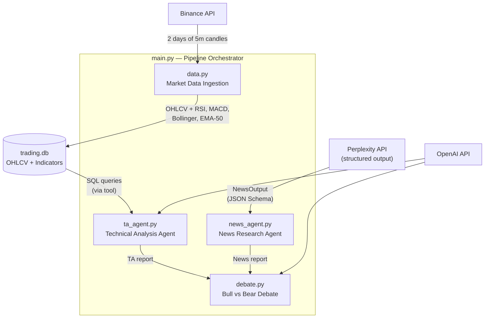
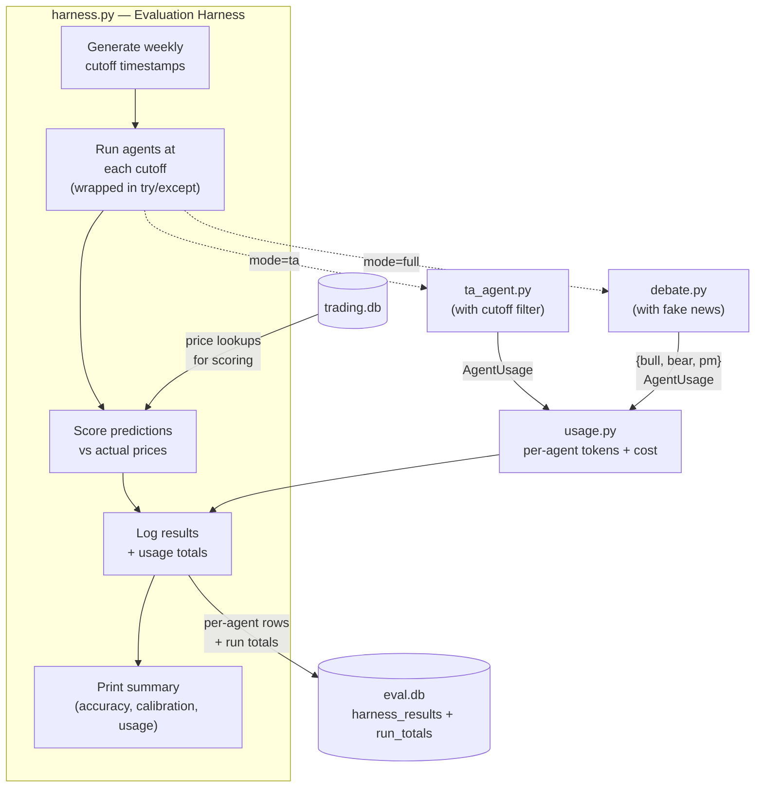
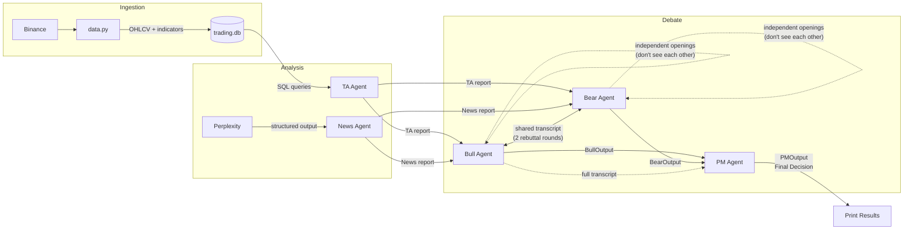

# Architecture

## System Diagram




## Harness Diagram




## Components

### main.py — Pipeline Orchestrator

Entry point that runs the full live pipeline in sequence: refresh market data from Binance, run TA agent, run news agent, run debate, print the final decision. Always fetches fresh data.

**In:** Optional `--fake-news` flag to skip Perplexity --> passes an empty  news report  
**Out:** Printed results (final PM decision with entry/stop/target)

### data.py — Market Data Ingestion

Fetches BTC/USDT 5-minute candles from Binance via CCXT, computes four technical indicators (RSI-14, MACD, Bollinger Bands, EMA-50), and upserts everything into SQLite. Also supports a `--backfill` mode to pull up to 90+ days of history for backtesting.

**In:** Nothing (pulls from Binance directly)
**Out:** `trading.db` with table `btc_ohlcv` (OHLCV + indicators, keyed by timestamp)

### ta_agent.py — Technical Analysis Agent

An agent (LangChain `create_agent`) with a SQL tool that queries `trading.db` to analyze price action. It decides which queries to run — recent candles, RSI extremes, MACD trend, Bollinger Band breakouts, EMA-50 position, volume — then produces a report and structured prediction. Uses `response_format=TAOutput` to get structured output directly from the agent.

The prompt requires the agent to state both a **bullish scenario** and a **bearish scenario** before deciding direction, and to pick NEUTRAL by default unless one scenario materially outweighs the other. A grounding rule forbids referencing data outside OHLCV + the computed indicators (no funding rates, on-chain, order books).

When given a cutoff timestamp (used by the harness for backtesting), the SQL tool silently replaces the table name with a filtered subquery so the agent only sees data up to that time.

The call is wrapped in `get_openai_callback()` so tokens, cost, and tool-call count are captured alongside the prediction.

**In:** Optional cutoff timestamp, optional prompt/model overrides
**Out:** `(TAOutput, AgentUsage)` — report + structured fields plus usage stats

### news_agent.py — News Research Agent

Single-phase agent. Perplexity's `sonar-pro` model researches the latest BTC news and returns a structured `NewsOutput` directly via their JSON Schema `response_format` — no separate OpenAI call. Has a `fake` mode that skips the Perplexity call and returns a hardcoded `NewsOutput` (used by the harness to avoid expensive API calls during backtesting).

**In:** Optional `fake=True` flag
**Out:** `NewsOutput` (report, direction, price prediction, confidence, key catalyst)

### debate.py — Bull vs Bear Debate

Three agents argue over the trade. The flow is:

1. Bull and Bear opening arguments (independent — each sees only the market data, not the other's opening)
2. 2 rounds of rebuttals (both see full transcript, each must introduce new arguments)
3. Bull structured final assessment (`BullOutput`)
4. Bear structured final assessment (`BearOutput`)
5. PM reviews the full transcript + both sides' numbers, renders final decision (`PMOutput`)

Opening arguments are independent to prevent anchoring bias. After openings, both sides share a message transcript so each rebuttal directly responds to the other side. Opening/rebuttal rounds use free-text chat; final assessments use `create_agent(response_format=...)`.

Risk:reward ratios are intentionally NOT computed or enforced in v2 — the focus is prediction accuracy (direction + levels). R:R gating and position-sizing logic will live in the v3 execution phase (FIX protocol + human-in-the-loop approval).

A grounding rule in the bull, bear, and PM system prompts forbids citing data not present in the TA/news reports (no futures funding, on-chain metrics, order books, etc.).

Each LLM call inside the debate is wrapped in `get_openai_callback()` and accumulated into a per-role `AgentUsage` (bull's opening + 2 rebuttals + final structured call are all summed under one `bull` usage record; same for bear; PM is a single call).

**In:** TA report text, news report text, optional prompt/model overrides
**Out:** Dict with `bull` (BullOutput), `bear` (BearOutput), `pm` (PMOutput), `messages` (full transcript), `usage` (dict of three `AgentUsage` objects)

### models.py — Pydantic Output Models

Defines the structured output schemas for every agent: `TAOutput`, `NewsOutput`, `BullOutput`, `BearOutput`, `PMOutput`. These are Pydantic models used with LangChain's structured output to get reliable, typed data from the LLMs. Each model has a free-text `report` field plus numeric prediction fields. `PMOutput.report` has a default of `""` so the call doesn't fail if the model occasionally omits it.

### usage.py — Per-Agent Usage Tracking

Small helper module defining `AgentUsage` (agent, model, tool_calls, input/output tokens, cost) and two helpers: `usage_from_callback()` builds an `AgentUsage` from a `get_openai_callback()` context result; `add_callback()` accumulates one callback's totals into an existing `AgentUsage` (used inside the debate to sum multiple calls under one role). Cost comes from LangChain's internal price table — no hand-rolled pricing dict. Only covers OpenAI calls; news_agent (Perplexity) is not tracked because the harness uses fake news.

### harness.py — Evaluation Harness

Runs the pipeline across multiple historical dates to measure prediction accuracy. Generates a list of weekly cutoff timestamps, runs the TA agent (and optionally the full debate) at each one, then looks up what the price actually did 1 week later to score the prediction.

Each cutoff's work is factored into `_run_one_cutoff()` and wrapped in try/except so a failure at one cutoff doesn't kill the whole backtest — failed cutoffs are printed and skipped.

Each agent's prediction is saved as a row in `harness_results` including the full reasoning (`report`, `key_point`, `winning_side`, trade levels) and the per-agent LLM usage (`model`, `tool_calls`, `input_tokens`, `output_tokens`, `cost`). A single row is also written to `run_totals` with aggregate totals for the run.

Two modes: `"ta"` (TA agent only, fast and cheap) and `"full"` (TA + debate + PM, uses fake news). Supports `AgentConfig` overrides so you can test different prompts or models against the same dates.

**In:** Start date, number of weeks, mode, optional agent config overrides
**Out:** List of `TestResult` objects + results saved to eval.db + printed summary with accuracy, calibration, and per-agent + total usage tables

## Data Flow




## Running the Pipeline

### Live Mode (main.py)

```bash
uv run main.py                    # full live run
uv run main.py --fake-news        # skip Perplexity, use hardcoded news
```

1. Refreshes market data from Binance
2. TA agent analyzes current data
3. News agent calls Perplexity for live research (or uses fake data)
4. Debate runs with real data
5. Prints the final PM decision

### Evaluation (harness.py)

```python
from harness import run_harness
run_harness(start_date="2026-02-01 12:00:00", num_weeks=5, mode="ta", run_label="baseline")
```

The harness runs the TA agent (or full pipeline) at multiple past cutoff dates and scores predictions against what actually happened. This is how you measure whether changes to prompts or models are improving accuracy.

## Databases


| Database     | Table             | Purpose                                                                                                                                        |
| ------------ | ----------------- | ---------------------------------------------------------------------------------------------------------------------------------------------- |
| `trading.db` | `btc_ohlcv`       | 5m OHLCV candles + technical indicators. Primary key: timestamp.                                                                               |
| `eval.db`    | `harness_results` | Per-agent scored predictions + reasoning (`report`, `key_point`, `entry`, `stop_loss`, `winning_side`) + LLM usage (`tokens`, `cost`, `tool_calls`). |
| `eval.db`    | `run_totals`      | One row per harness run — aggregate tool calls, tokens, and cost across all agents and cutoffs.                                               |

Schema migrations for `harness_results` use `ALTER TABLE ADD COLUMN` via `_ensure_columns()` so older eval databases pick up new columns automatically.


